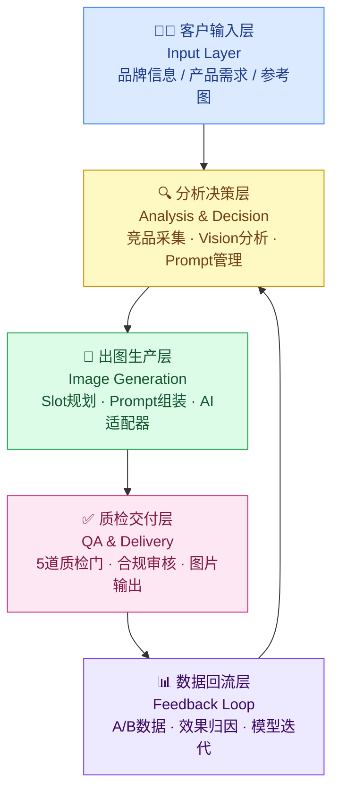

# 系统架构文档

> **项目**：Auto Image Pipeline — 跨境电商自动化主图生产系统  
> **版本**：L2 MVP  
> **更新**：2026-04-17  
> **状态**：Wave 1 已完成（T1-T4），Wave 2-3 建设中

---

## 系统概览

Auto Image Pipeline 是一套面向跨境电商卖家的全流程图片生产系统，覆盖从客户需求输入到亚马逊主图交付的完整链路。系统核心逻辑是一个持续自优化的闭环：**看市场 → 出设计 → 拿结果 → 沉淀结论**。数据驱动贯穿始终，三个数据引擎持续喂养决策层：引擎A 消费亚马逊公开数据（竞品基准、关键词热度）；引擎B 积累 A/B 测试实验结果；引擎C 维护品牌画像，确保跨 SKU 的视觉一致性。L2 阶段以模板驱动 + 人工触发为主，不引入自动调度，优先跑通端到端链路。

系统分为五层，各层职责单一、数据流向清晰：



---

## 模块清单

下表列出全部 16 个任务模块，覆盖 Wave 1 到 Wave 4。当前 L2 阶段完成 T1-T4，其余模块按 Wave 计划推进。

| 模块名 | 对应任务 | 职责 | 输入 | 输出 | 依赖 |
|--------|----------|------|------|------|------|
| 项目脚手架 | T1 | 初始化目录结构、依赖管理、CI 配置 | 无 | 可运行的项目骨架 | 无 |
| 标签体系常量 | T2 | 定义三层标签分类法：INTENT_TAGS(6)、ROLE_TAGS(7)、SLOT_MAPPING(8) 及视觉标签 | 无 | `pipeline/constants/tags.py` | T1 |
| SQLite ORM | T3 | 定义所有数据表（Project、BrandProfile、AmazonBenchmark、PromptAsset、SlotPlan、QARecord、ABTest、TagAssignment），管理数据库会话 | 无 | `pipeline/models/*.py`，SQLite 数据库文件 | T1, T2 |
| 配置管理 | T4 | 以 dataclass 封装所有环境变量和运行时参数，支持 `.env` 加载 | 环境变量 / `.env` 文件 | `Config` 单例 | T1 |
| 客户输入层 | T5 | 接收客户提交的品牌信息、产品参数、参考图，写入 Project 和 BrandProfile 表 | 表单数据 / CLI 参数 | Project 记录，BrandProfile 记录 | T3, T4 |
| Amazon数据采集 | T6 | 通过 Keepa API 抓取竞品 ASIN 数据（价格、评分、图片），写入 AmazonBenchmark 表 | ASIN 列表，Keepa API Key | AmazonBenchmark 记录集 | T3, T4 |
| 竞品Vision分析 | T7 | 调用 GPT-4o Vision 对竞品主图进行视觉元素解析，提取配色、构图、卖点布局等特征 | 竞品图片 URL，GPT-4o API Key | 结构化 Vision 报告（JSON），写入 AmazonBenchmark.vision_analysis | T6 |
| Prompt CRUD | T8 | 提供 Prompt 资产的增删改查接口，管理 Prompt 版本和标签关联 | Prompt 文本，Tag 集合 | PromptAsset 记录，TagAssignment 记录 | T2, T3 |
| Prompt组装引擎 | T9 | 根据品牌画像、竞品分析结果、标签选择，动态组装最终 Prompt | BrandProfile，Vision报告，Tag选择 | 完整 Prompt 字符串 | T7, T8 |
| Slot Plan生成器 | T10 | 根据产品类目和卖点矩阵，规划一组主图的 Slot 分配方案（主图/场景图/白底图等） | Project记录，竞品基准 | SlotPlan 记录集 | T5, T6, T9 |
| AI出图抽象层 | T11 | 统一封装多个 AI 出图后端（Flux、Midjourney、ComfyUI），对上层暴露相同接口 | Prompt，Slot配置，后端选择 | 图片文件，生成元数据 | T9, T10 |
| QA Gate | T12 | 执行 5 道质检门：合规前置门、Visual Anchor门、Reference Chain门、Consistency System门、QA Gate门；写入 QARecord | 生成图片，SlotPlan，品牌规范 | QARecord，通过/拒绝决策，问题标注 | T10, T11 |
| 数据回流 | T13 | 收集 A/B 测试结果和投放效果数据，写入 ABTest 表，触发 Prompt 资产的效果归因更新 | 投放数据，A/B 实验结果 | ABTest 记录，PromptAsset 效果分 | T3, T12 |
| CLI + Pipeline编排 | T14 | 提供命令行入口，串联各层模块，支持按 Stage 单步执行或全流程运行 | CLI 参数 | 执行日志，各层产物 | T5-T13 |
| Flask Web UI | T15 | 提供可视化操作界面：项目管理、Prompt 编辑、QA 审核、数据看板 | HTTP 请求 | HTML 页面，JSON API 响应 | T14 |
| TWS端到端验证 | T16 | 真实 SKU 全链路冒烟测试，验证从客户输入到图片交付的完整流程 | 测试 SKU 数据集 | 测试报告，覆盖率指标 | T15 |

---

## 技术选型表

| 组件 | 选择 | 理由 | 替代方案 |
|------|------|------|----------|
| 编程语言 | Python 3.11+ | 生态完整，AI SDK 覆盖率最高，团队熟悉 | Node.js（异步好但 AI 库弱），Go（性能好但 AI 生态差） |
| 数据库 | SQLite | L2 阶段单机运行，零运维成本，schema 迁移简单，Alembic 支持完善 | PostgreSQL（L3+ 多实例时迁移），MySQL |
| ORM | SQLAlchemy 2.x | 成熟稳定，支持 SQLite 和 PostgreSQL 无缝切换，配合 Alembic 做 migration | Tortoise ORM（异步），Peewee（轻量但功能弱） |
| Web 框架 | Flask | 轻量，适合 L2 阶段内部工具，蓝图结构清晰，上手快 | FastAPI（L3 推荐，自带 OpenAPI），Django（太重） |
| 竞品数据 | Keepa API | 提供亚马逊历史价格、销量、评分、图片等结构化数据，API 稳定 | 自建爬虫（维护成本高），Jungle Scout API（价格高） |
| 竞品视觉分析 | GPT-4o Vision | 多模态能力强，能解析图片中的构图、配色、文字卖点，输出结构化 JSON | Claude 3.5 Sonnet Vision（备选），Gemini 1.5 Pro Vision |
| AI 出图后端 | Flux / Midjourney / ComfyUI（抽象层统一调度） | 不锁定单一供应商，Flux 适合本地部署，MJ 质量高，ComfyUI 支持工作流定制 | DALL-E 3（质量稳定但定制性差），Stable Diffusion API |
| 配置管理 | python-dotenv + dataclass | 零依赖，类型安全，IDE 补全友好 | Pydantic Settings（更严格的类型验证，L3 可迁移） |
| 日志 | Python logging + structlog | 结构化日志便于后续接入可观测性系统 | loguru（简洁但扩展性弱） |
| 测试 | pytest + pytest-cov | 生态标准，fixture 机制成熟 | unittest（冗余），nose2（不活跃） |
| 依赖管理 | pip + requirements.txt / pyproject.toml | 当前阶段够用，无锁版本风险 | Poetry（L3 推荐），uv（更快） |

---

## 目录结构

```
auto-image-pipeline/                  # 项目根目录
├── pipeline/                         # 核心业务包
│   ├── __init__.py                   # 包初始化，暴露版本号
│   ├── __main__.py                   # CLI 入口，解析命令行参数，编排各层 (T14)
│   ├── config.py                     # Config dataclass，读取环境变量 (T4)
│   │
│   ├── constants/                    # 静态常量，无副作用
│   │   ├── __init__.py
│   │   └── tags.py                   # 三层标签体系：INTENT_TAGS / ROLE_TAGS / SLOT_MAPPING / visual tags (T2)
│   │
│   ├── models/                       # SQLAlchemy ORM 数据模型
│   │   ├── __init__.py               # 统一导出所有 Model 类
│   │   ├── base.py                   # SQLAlchemy Base + engine 工厂 + Session 工厂 (T3)
│   │   ├── project.py                # Project 表：项目元信息 (T3)
│   │   ├── brand.py                  # BrandProfile 表：品牌画像（色调、字体、调性）(T3)
│   │   ├── benchmark.py              # AmazonBenchmark 表：竞品采集数据 + Vision分析结果 (T3)
│   │   ├── prompt_asset.py           # PromptAsset 表：Prompt 资产及版本 (T3)
│   │   ├── slot_plan.py              # SlotPlan 表：主图 Slot 分配方案 (T3)
│   │   ├── qa_record.py              # QARecord 表：质检门结果记录 (T3)
│   │   ├── ab_test.py                # ABTest 表：A/B 实验数据 (T3)
│   │   └── tag_assignment.py         # TagAssignment 表：标签与资产的多对多关联 (T3)
│   │
│   ├── layers/                       # 五层业务逻辑（Wave 2-3 实现）
│   │   ├── input_layer.py            # 客户输入层：接收品牌/产品/参考图 (T5)
│   │   ├── amazon_data.py            # Amazon数据采集：Keepa API 封装 (T6)
│   │   ├── vision_analysis.py        # 竞品Vision分析：GPT-4o Vision 调用 (T7)
│   │   ├── prompt_crud.py            # Prompt CRUD：资产管理接口 (T8)
│   │   ├── prompt_engine.py          # Prompt组装引擎：动态拼装最终 Prompt (T9)
│   │   ├── slot_planner.py           # Slot Plan生成器：规划主图组合方案 (T10)
│   │   ├── qa_gate.py                # QA Gate：5道质检门执行器 (T12)
│   │   └── feedback_loop.py          # 数据回流：A/B结果归因，效果分更新 (T13)
│   │
│   ├── adapters/                     # AI 出图适配器抽象层（Wave 3）
│   │   ├── __init__.py               # 统一导出 generate() 接口
│   │   ├── base_adapter.py           # 抽象基类，定义 generate() 签名 (T11)
│   │   ├── flux_adapter.py           # Flux 本地/API 适配器 (T11)
│   │   ├── midjourney_adapter.py     # Midjourney API 适配器 (T11)
│   │   └── comfyui_adapter.py        # ComfyUI workflow 适配器 (T11)
│   │
│   └── utils/
│       ├── __init__.py
│       └── logger.py                 # 结构化日志配置，全局 logger 工厂
│
├── tests/                            # 测试套件
│   ├── unit/                         # 单元测试，无 IO，快速
│   ├── integration/                  # 集成测试，使用真实 SQLite（内存模式）
│   └── e2e/                          # 端到端验证脚本 (T16)
│
├── data/                             # 运行时数据目录（不入 Git）
│   ├── pipeline.db                   # SQLite 数据库文件
│   ├── images/                       # 生成图片存储
│   └── exports/                      # 交付包导出
│
├── templates/                        # Flask Jinja2 模板（T15）
│   ├── base.html
│   ├── projects/
│   ├── prompts/
│   └── qa/
│
├── static/                           # Flask 静态资源（T15）
│   ├── css/
│   └── js/
│
├── docs/                             # 项目文档
│   ├── architecture.md               # 本文件
│   ├── adr/                          # 架构决策记录
│   └── api/                          # API 文档（T15 完成后生成）
│
├── .env.example                      # 环境变量模板
├── pyproject.toml                    # 项目元信息 + 依赖声明
├── requirements.txt                  # 锁定依赖版本
└── README.md                         # 快速上手指南
```

---

## 成熟度路线

系统设计遵循渐进演进原则，分三个成熟度等级逐步交付价值，避免过早引入不必要的复杂性。

### L2 — 模板驱动 + 人工触发（当前目标）

**定位**：可用的 MVP，跑通端到端链路，验证核心假设。

- 所有流程通过 CLI 命令手动触发，无自动调度
- Prompt 以模板为主，人工审核后写入 PromptAsset 表
- 单机 SQLite，不考虑并发写入
- QA Gate 返回建议，人工决策是否重新生成
- 数据回流仅做记录，不触发自动 Prompt 调整
- AI 出图后端任选其一，抽象层接口打通即可
- Flask Web UI 提供基础操作界面，替代纯 CLI

**交付物**：T1-T16 全部完成，通过 T16 端到端冒烟测试。

---

### L3 — 事件驱动 Pipeline（下一阶段）

**触发条件**：L2 稳定运行，有 3+ 个真实 SKU 完整跑通。

在 L2 基础上新增：

- 引入 Python 原生任务队列（如 Celery + Redis，或轻量 rq），实现异步出图和 QA
- 数据库迁移至 PostgreSQL，支持多用户并发写入
- QA Gate 结果自动触发重试逻辑（失败次数 < N 时自动 rerun）
- Prompt 效果分达到阈值后，自动标记为"推荐模板"
- 配置管理迁移至 Pydantic Settings，支持多环境（dev / staging / prod）
- Web UI 增加实时进度展示（WebSocket 或 SSE）
- 依赖管理迁移至 Poetry，引入 pre-commit hooks

---

### L4 — 自优化闭环（长期目标）

**触发条件**：引擎B（A/B 测试数据）积累到足够样本量，回流数据质量可靠。

在 L3 基础上新增：

- 数据回流层自动触发 Prompt 优化建议（LLM 归因分析）
- 效果差的 Slot 方案自动降权，高效方案自动复用
- 引擎A 定时刷新竞品基准，触发视觉风格漂移告警
- 引擎C 品牌画像支持自动更新，新 SKU 自动继承品牌规范
- 系统具备自我评估能力：定期生成生产质量报告，识别瓶颈 Slot
- 支持多租户，各品牌数据完全隔离

---

## 质检门设计

QA Gate（T12）串行执行 5 道检查，任意一道拒绝则图片进入人工审核队列：

| 序号 | 门名称 | 检查内容 | 拦截动作 |
|------|--------|----------|----------|
| 1 | 合规前置门 | 图片内容合规性检查，排除违禁元素、虚假宣传 | 硬拒绝，记录违规类型 |
| 2 | Visual Anchor 门 | 主视觉锚点是否突出（产品主体占比、焦点清晰度）| 标记为"焦点模糊"，建议重新生成 |
| 3 | Reference Chain 门 | 生成图与参考图的视觉相关性（颜色、构图相似度）| 相似度低于阈值时拒绝 |
| 4 | Consistency System 门 | 跨 Slot 的视觉一致性（字体、色调、品牌元素统一）| 标记不一致 Slot，触发局部重生成 |
| 5 | QA Gate 门 | 综合评分门禁，整合前 4 道结果，输出最终通过/拒绝决策 | 写入 QARecord，驱动 Slot Plan 状态流转 |

---

## 非功能性需求

以下约束适用于 L2 MVP 阶段，L3+ 阶段按实际规模调整。

### 并发

- L2 为单用户单进程，不要求并发写入
- Flask 开发服务器（单线程）足够，不引入 Gunicorn / Nginx
- AI 出图请求为外部 API 调用，通过 Python `concurrent.futures` 控制并发数 ≤ 3，避免触发 API 限流

### 延迟

- CLI 单 SKU 全流程（不含 AI 出图等待）目标 < 30 秒
- AI 出图单张目标响应 < 60 秒（受后端 API 影响，非系统瓶颈）
- Flask Web UI 页面响应目标 < 1 秒（SQLite 查询在 L2 规模下无性能问题）

### 存储

- SQLite 数据库文件目标 < 500 MB（L2 阶段数据量可控）
- 生成图片存本地 `data/images/`，按项目 + 日期组织目录，单 SKU 存储目标 < 50 MB
- 不引入对象存储（S3 / OSS），L3 阶段按需迁移

### 安全

- API Key（Keepa、OpenAI 等）全部通过 `.env` 文件注入，不硬编码，`.env` 列入 `.gitignore`
- SQLite 文件存于 `data/` 目录，列入 `.gitignore`，不提交至版本库
- Flask 仅监听 `127.0.0.1`，L2 阶段不对外暴露端口
- 无用户认证需求（L2 为个人/小团队工具），L3 引入 Flask-Login

### 可维护性

- 全量 pytest 执行时间目标 < 60 秒
- 单模块圈复杂度目标 ≤ 10
- 所有公开函数/类需有 docstring
- 数据库 schema 变更必须通过 Alembic migration，不直接修改数据库

---

*文档由 AI 辅助生成，最终由工程负责人审核确认。如有出入，以代码实现为准。*
