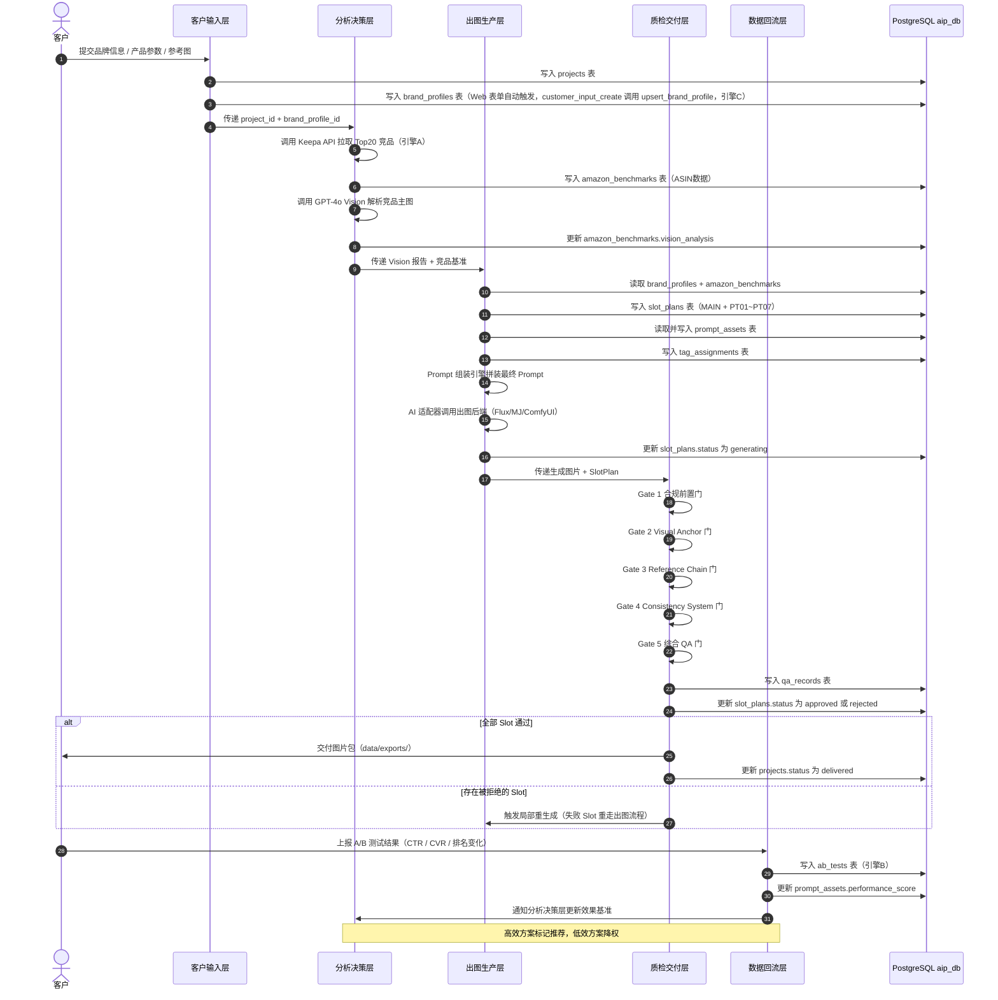
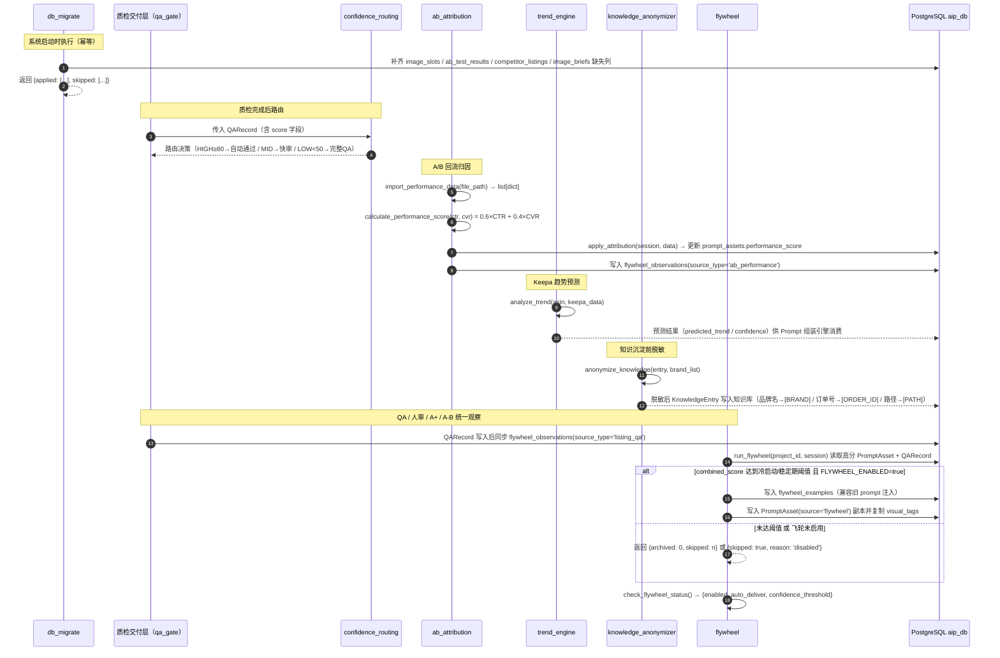

# 数据流文档

> **项目**：Auto Image Pipeline — 跨境电商自动化主图生产系统
> **版本**：v1.2
> **更新**：2026-05-13
> **关联文档**：[architecture.md](./architecture.md)

---

## 概览

系统数据流遵循单一方向主干加回流支路的设计：客户输入的品牌信息和产品需求，经过分析决策层的竞品挖掘与 Vision 解析，驱动出图生产层完成 Slot 规划和 Prompt 组装，再经质检交付层的 5 道质检门，最终产出合规图片交付客户。交付后收集的 A/B 测试数据通过数据回流层反哺分析决策层，形成持续自优化的闭环。

三个数据引擎贯穿全链路：

- **引擎A**：消费亚马逊公开数据（Keepa API），持续刷新竞品基准库
- **引擎B**：积累 A/B 测试实验结果，驱动 Prompt 效果归因
- **引擎C**：维护品牌画像，确保跨 SKU 的视觉一致性

核心业务循环：**看市场 → 出设计 → 拿结果 → 沉淀结论**

---

## 端到端数据流序列图

下图展示从客户输入到图片交付的完整数据流，覆盖全部五层。



---

## 每层数据变换

### 第一层：客户输入层（Input Layer）

| 维度     | 内容                                                                                                                                                                                                                                                                                          |
| -------- | --------------------------------------------------------------------------------------------------------------------------------------------------------------------------------------------------------------------------------------------------------------------------------------------- |
| **输入** | 品牌名称、主色调（十六进制色值）、字体风格、产品类目（L1+L2 级联选择器，关键字可搜索，数据源 amazon_categories.py；UI 选择后将 Keepa catId 写入隐藏字段 `product_category` 提交）、目标市场（如 Amazon US）、竞品 ASIN 列表（可选）、参考图文件                                               |
| **处理** | 表单验证与参数归一化；asin 为可选字段，无 ASIN 时进入 category-only 降级路径（跳过 ASIN 详情采集和 listing/review/qa/price/promo 分析，仍运行品类竞品基准采集和 Vision 分析）；参考图写入 `data/images/refs/`；project 记录写库；Web 表单创建项目时自动调用 upsert_brand_profile 创建品牌画像 |
| **输出** | `projects` 表记录（含 project_id 和 status=active）；`brand_profiles` 表记录（含完整品牌视觉规范，供引擎C 使用）                                                                                                                                                                              |

### 第二层：分析决策层（Analysis & Decision）

| 维度     | 内容                                                                                                           |
| -------- | -------------------------------------------------------------------------------------------------------------- |
| **输入** | project_id、目标 ASIN 列表、Keepa API Key、GPT-4o API Key                                                      |
| **处理** | 引擎A：Keepa API 批量拉取竞品价格、评分、图片 URL；GPT-4o Vision 逐图解析构图、配色、卖点布局，输出结构化 JSON |
| **输出** | `amazon_benchmarks` 记录集（含 ASIN 原始数据和 `vision_analysis` JSON 字段）；Top20 基准库，供出图生产层消费   |

### 第三层：出图生产层（Image Generation）

| 维度     | 内容                                                                                                                                                                                                                                                                                                                                                |
| -------- | --------------------------------------------------------------------------------------------------------------------------------------------------------------------------------------------------------------------------------------------------------------------------------------------------------------------------------------------------- |
| **输入** | `brand_profiles` 记录（引擎C）、`amazon_benchmarks` Vision 报告（引擎A）、`product_profiles` 记录（品类/价位/卖点）、`customer_briefs` 记录（客户诉求/风格偏好）、SLOT_MAPPING 配置（MAIN + PT01~PT07） [已实现 ✅]                                                                                                                                 |
| **处理** | Slot Plan 生成器综合四路上下文调用 LLM 驱动决策，规划 8 个 Slot（降级链：LLM → brief_tags → 默认值）；brief_generator 结合 brand_profile + product_profile 生成含 target_tags 的结构化 Brief；Prompt 组装引擎结合品牌画像、Vision 报告、INTENT_TAGS（6个）和 ROLE_TAGS（7个）拼装最终 Prompt；AI 适配器调用出图后端；标签关联写入 `tag_assignments` |
| **输出** | `slot_plans` 记录集（每 Slot 一条，status=planned→generating）；`prompt_assets` 记录（含版本号）；`tag_assignments` 关联记录；生成图片文件（`data/images/{project_id}/`）                                                                                                                                                                           |

### 第四层：质检交付层（QA & Delivery）

| 维度     | 内容                                                                                                                                        |
| -------- | ------------------------------------------------------------------------------------------------------------------------------------------- |
| **输入** | 生成图片本地路径、`slot_plans` 记录、`brand_profiles`（品牌规范）、参考图路径                                                               |
| **处理** | 串行执行 5 道质检门：合规前置门 → Visual Anchor 门 → Reference Chain 门 → Consistency System 门 → 综合 QA 门；每道门输出通过/拒绝及问题标注 |
| **输出** | `qa_records` 记录（含每道门结果）；`slot_plans.status` 流转（generating → approved / rejected）；交付包 `data/exports/{project_id}/`        |

### 第五层：数据回流层（Feedback Loop）

| 维度     | 内容                                                                                                                                                                                                                                  |
| -------- | ------------------------------------------------------------------------------------------------------------------------------------------------------------------------------------------------------------------------------------- |
| **输入** | QA 评分、人审评分、A+ QA/人审结果、A/B 测试结果（CTR、CVR、自然排名变化）、对应的 slot_plan_id / prompt_asset_id / aplus_content_id                                                                                                  |
| **处理** | 引擎B：写入 ABTest/ABTestResult；加权计算 Prompt 资产效果分；所有反馈统一写入 `flywheel_observations`；高分 observation 再归档为 `flywheel_examples` 和 `PromptAsset(source="flywheel")`，供下一轮 prompt 注入与品牌 ELASTIC 写回使用 |
| **输出** | `ab_tests` / `ab_test_results` 记录；`prompt_assets.performance_score` 更新；`flywheel_observations` 观察记录；合格样本进入 `flywheel_examples`；品牌画像与 category priors 按门槛更新                                                 |

---

## 数据存储映射

### 表关系概览

```
projects (1) ─────────────── (1) brand_profiles
    │
    ├── (1:N) amazon_benchmarks    [引擎A 输出，一个项目对应多个竞品ASIN]
    │
    ├── (1:N) slot_plans ──── (N:1) prompt_assets
    │             │                      │
    │             │                 tag_assignments  [多对多：PromptAsset <-> Tag]
    │             │                      │
    │             │                      ├── (1:N) qa_records
    │             │                      └── (1:N) flywheel_observations
    │             │
    │             └── (1:N) qa_records   [每个 Slot 可有多次 QA/重试记录]
    │
    ├── (1:N) aplus_contents ────── (1:N) flywheel_observations
    │
    ├── (1:N) ab_tests              [引擎B 输出，关联 slot_plan + prompt_asset]
    │
    ├── (1:N) flywheel_observations [QA/人审/A+/A-B 统一观察层]
    │
    └── (1:N) flywheel_examples     [高分 observation 的兼容归档层]
```

### projects — 项目与客户信息

| 字段             | 类型       | 说明                                            |
| ---------------- | ---------- | ----------------------------------------------- |
| id               | INTEGER PK | 自增主键                                        |
| name             | TEXT       | 项目名称                                        |
| client_name      | TEXT       | 客户/品牌名                                     |
| product_category | TEXT       | 产品类目（如 TWS Earphone）                     |
| target_market    | TEXT       | 目标市场（如 Amazon US）                        |
| asin_targets     | TEXT       | 目标竞品 ASIN 列表（JSON 序列化）               |
| status           | TEXT       | 项目状态：draft / active / delivered / archived |
| created_at       | DATETIME   | 创建时间                                        |
| updated_at       | DATETIME   | 最后更新时间                                    |

**关系**：一个 project 对应一个 brand_profile（1:1），对应多条 amazon_benchmark（1:N），对应多条 slot_plan（1:N），对应多条 ab_test（1:N）。

### brand_profiles — 品牌画像（引擎C）

| 字段              | 类型       | 说明                                      |
| ----------------- | ---------- | ----------------------------------------- |
| id                | INTEGER PK | 自增主键                                  |
| project_id        | INTEGER FK | 关联 projects.id                          |
| primary_colors    | TEXT       | 主色调列表（JSON，十六进制色值）          |
| font_style        | TEXT       | 字体风格描述                              |
| brand_tone        | TEXT       | 品牌调性关键词（如 premium / minimalist） |
| visual_guidelines | TEXT       | 视觉规范文本，供 Prompt 组装引擎消费      |
| logo_path         | TEXT       | Logo 文件本地路径                         |
| created_at        | DATETIME   | 创建时间                                  |

**作用**：引擎C 的核心载体。Prompt 组装时注入品牌约束，确保同一项目下所有 Slot 的视觉风格一致。

### amazon_benchmarks — 竞品分析数据（引擎A）

| 字段            | 类型       | 说明                                                 |
| --------------- | ---------- | ---------------------------------------------------- |
| id              | INTEGER PK | 自增主键                                             |
| project_id      | INTEGER FK | 关联 projects.id                                     |
| asin            | TEXT       | 竞品 ASIN                                            |
| rank            | INTEGER    | Best Seller Rank                                     |
| rating          | FLOAT      | 星级评分                                             |
| review_count    | INTEGER    | 评论数量                                             |
| image_urls      | TEXT       | 主图 URL 列表（JSON）                                |
| keepa_raw       | TEXT       | Keepa API 原始响应（JSON）                           |
| vision_analysis | TEXT       | GPT-4o Vision 解析结果（JSON：构图、配色、卖点布局） |
| fetched_at      | DATETIME   | 数据采集时间                                         |

**作用**：引擎A 的输出落地点。`vision_analysis` 字段是 Slot Plan 生成器和 Prompt 组装引擎的核心参考输入。

### prompt_assets — Prompt 资产

| 字段              | 类型       | 说明                                      |
| ----------------- | ---------- | ----------------------------------------- |
| id                | INTEGER PK | 自增主键                                  |
| name              | TEXT       | Prompt 资产名称                           |
| content           | TEXT       | Prompt 正文                               |
| version           | INTEGER    | 版本号（从 1 开始递增）                   |
| slot_type         | TEXT       | 适用 Slot 类型（MAIN / ALT1~ALT7 / APLUS_*） |
| performance_score | FLOAT      | 效果分，由引擎B 回流数据计算，初始为 NULL |
| is_recommended    | BOOLEAN    | 是否标记为推荐模板                        |
| created_at        | DATETIME   | 创建时间                                  |
| updated_at        | DATETIME   | 最后更新时间                              |

**作用**：Prompt 资产库的核心表，支持版本管理和效果归因。引擎B 的 A/B 结果最终体现为 `performance_score` 字段更新；飞轮归档会额外创建 `source="flywheel"` 的兼容 PromptAsset 副本，并保留 `visual_tags` 供品牌 ELASTIC 写回。

### slot_plans — Slot 分配方案

| 字段            | 类型       | 说明                                                             |
| --------------- | ---------- | ---------------------------------------------------------------- |
| id              | INTEGER PK | 自增主键                                                         |
| project_id      | INTEGER FK | 关联 projects.id                                                 |
| slot_type       | TEXT       | Slot 类型：MAIN / PT01 / PT02 / PT03 / PT04 / PT05 / PT06 / PT07 |
| slot_purpose    | TEXT       | Slot 用途描述（如 "场景图-运动使用"）                            |
| prompt_asset_id | INTEGER FK | 使用的 Prompt 资产                                               |
| image_path      | TEXT       | 生成图片本地路径                                                 |
| status          | TEXT       | 状态流转：planned / generating / approved / rejected             |
| retry_count     | INTEGER    | 重试次数                                                         |
| created_at      | DATETIME   | 创建时间                                                         |

**作用**：串联出图生产层和质检交付层的枢纽表。`status` 字段驱动整个 Slot 的生命周期流转，`retry_count` 防止无限重试。

### qa_records — 质检记录

| 字段                   | 类型       | 说明                               |
| ---------------------- | ---------- | ---------------------------------- |
| id                     | INTEGER PK | 自增主键                           |
| slot_plan_id           | INTEGER FK | 关联 slot_plans.id                 |
| gate_1_compliance      | BOOLEAN    | 合规前置门结果                     |
| gate_2_visual_anchor   | BOOLEAN    | Visual Anchor 门结果               |
| gate_3_reference_chain | FLOAT      | Reference Chain 相似度分（0~1）    |
| gate_4_consistency     | BOOLEAN    | Consistency System 门结果          |
| gate_5_overall         | BOOLEAN    | 综合 QA 门最终决策                 |
| issues                 | TEXT       | 问题标注（JSON，各门拒绝原因详情） |
| reviewed_at            | DATETIME   | 质检执行时间                       |

**作用**：记录每个 Slot 的完整质检过程，支持问题追溯、失败原因统计和质检质量分析。

### flywheel_observations — 统一飞轮观察记录

| 字段                | 类型       | 说明                                                                 |
| ------------------- | ---------- | -------------------------------------------------------------------- |
| id                  | INTEGER PK | 自增主键                                                             |
| project_id          | INTEGER FK | 关联 projects.id                                                     |
| prompt_asset_id     | INTEGER FK | 可空；主图/Listing/A-B 来源关联 prompt_assets.id                     |
| aplus_content_id    | INTEGER FK | 可空；A+ 来源关联 aplus_contents.id                                  |
| slot_index          | INTEGER    | 主图槽位索引，可空                                                   |
| slot_type           | TEXT       | 标准化槽位：MAIN / ALT1~ALT7 / APLUS_HERO 等                         |
| intent_tag          | TEXT       | SlotPlan 意图标签，可空                                              |
| module_type         | TEXT       | A+ 模块类型，可空                                                    |
| source_type         | TEXT       | listing_qa / listing_human / aplus_qa / ab_performance 等            |
| prompt_text         | TEXT       | 当时使用的提示词                                                     |
| qa_score            | FLOAT      | QA 0~100 归一化为 0~5                                                |
| human_score         | FLOAT      | 人审 1~5 分                                                          |
| conversion_score    | FLOAT      | A/B 归因分，通常为 0.6×CTR + 0.4×CVR                                 |
| combined_score      | FLOAT      | 可复用判断分，当前为可用 QA/人审分平均                               |
| delivery_status     | TEXT       | final / concept_only / failed 等交付状态                             |
| reference_basis     | TEXT       | JSON 文本，记录真实参考图/构图参考等依据                             |
| qa_details          | TEXT       | QA 细节 JSON                                                         |
| human_details       | TEXT       | 人审细节 JSON                                                        |
| performance_details | TEXT       | CTR/CVR/performance_score JSON                                       |
| visual_tags         | TEXT       | 视觉标签 JSON，供 ELASTIC 写回                                       |
| failure_tags        | TEXT       | 失败类型标签                                                         |
| metadata_json       | TEXT       | 其他来源元数据                                                       |
| tenant_id           | INTEGER    | 保留兼容字段                                                         |
| created_at          | DATETIME   | 创建时间                                                             |

**作用**：这是当前飞轮的权威观察层。QA、人审、A+、A/B 不再各自形成孤立闭环，而是先沉淀为可审计 observation，再由归档/品牌写回/品类先验模块决定是否进入下一轮 prompt 注入。

### ab_tests — A/B 测试数据回流（引擎B）

| 字段             | 类型       | 说明                         |
| ---------------- | ---------- | ---------------------------- |
| id               | INTEGER PK | 自增主键                     |
| project_id       | INTEGER FK | 关联 projects.id             |
| slot_plan_id     | INTEGER FK | 关联 slot_plans.id           |
| prompt_asset_id  | INTEGER FK | 关联 prompt_assets.id        |
| variant          | TEXT       | A/B 实验变体标识（A / B）    |
| ctr              | FLOAT      | 点击率（Click-Through Rate） |
| cvr              | FLOAT      | 转化率（Conversion Rate）    |
| rank_change      | INTEGER    | 自然排名变化（正数=上升）    |
| test_period_days | INTEGER    | 测试周期（天）               |
| collected_at     | DATETIME   | 数据采集时间                 |
| notes            | TEXT       | 备注（如促销期间等异常标注） |

**作用**：引擎B 的核心数据表。回流数据经 `feedback_loop.py` 处理后更新 `prompt_assets.performance_score`，驱动 Prompt 资产的效果排名动态调整。

### tag_assignments — 标签关联

| 字段       | 类型       | 说明                                                |
| ---------- | ---------- | --------------------------------------------------- |
| id         | INTEGER PK | 自增主键                                            |
| asset_id   | INTEGER FK | 关联 prompt_assets.id                               |
| tag_type   | TEXT       | 标签层级：INTENT / ROLE / SLOT / VISUAL             |
| tag_value  | TEXT       | 标签值（如 `highlight_feature`、`lifestyle_model`） |
| created_at | DATETIME   | 创建时间                                            |

**作用**：实现 Prompt 资产与三层标签体系的多对多关联。INTENT_TAGS（6个）描述创作意图，ROLE_TAGS（7个）描述视觉角色，SLOT_MAPPING（8个 Slot）定位使用场景。支持按标签检索资产和按标签维度统计效果分。

---

## 数据生命周期

### 创建阶段

数据随业务操作依序写入：客户提交表单时，`projects` 和 `brand_profiles` 同步创建；Keepa 采集任务完成后，`amazon_benchmarks` 批量写入；Slot 规划完成后，`slot_plans` 以 `planned` 状态批量创建；Prompt 组装完成后，`prompt_assets` 和 `tag_assignments` 写入。

### 活跃阶段

Slot 生命周期状态流转如下：

```
planned
   │
   ▼
generating ──(出图成功)──► 进入 QA
   │
(出图失败)
   │
   ▼
rejected ──(retry_count < 上限)──► planned（重试）
          └─(retry_count 达上限)──► 人工审核队列
```

QA 阶段的状态流转：

```
generating ──(Gate 1~5 全部通过)──► approved ──► 打包交付
           └─(任意 Gate 拒绝)────► rejected ──► 局部重生成 / 人工审核
```

`prompt_assets` 在活跃阶段通过版本号迭代，旧版本保留不删除，支持回滚对比和效果溯源。

### 回流更新阶段

A/B 测试数据回收后，`ab_tests` 写入新记录，`prompt_assets.performance_score` 滚动更新，同时写入 `flywheel_observations(source_type='ab_performance')` 作为统一观察记录。效果分计算示例：

```
performance_score = 0.6 × CTR_normalized + 0.4 × CVR_normalized
```

权重可通过配置调整。当前归因阈值由代码常量控制，效果分达标的资产标记 `is_recommended = True`；是否进入 prompt 复用则由 `FlywheelObservation.combined_score` / `FlywheelExample` 归档规则决定。

### 归档阶段

项目交付完成后的数据处置流程：

- `projects.status` 更新为 `delivered`，生成图片打包至 `data/exports/{project_id}/`
- 30 天后 `projects.status` 更新为 `archived`
- `archived` 状态的项目数据不参与 Prompt 效果分计算，避免过时数据污染引擎B
- PostgreSQL `aip_db` 保留完整历史；SQLite 仅用于现有测试兼容，不作为真实运行数据库

---

## TWS 耳机贯穿示例

本节以真实业务场景为例，演示一个 TWS 蓝牙耳机 SKU 从客户 Brief 到图片交付、再到 A/B 回流的完整数据流。

### 场景背景

**客户**：NovaBeat Audio，新兴音频品牌，主打年轻用户群体，品牌色为深空黑加荧光绿。

**需求**：为 TWS 耳机新品在 Amazon US 上架制作一组主图（主图 MAIN 加 7 张副图 PT01~PT07）。

**客户提供**：品牌 Brief 文档、竞品 ASIN 5 个（Sony WF-1000XM5、Anker Q45、Jabra Evolve2 等型号）、产品实拍参考图 3 张。

---

### Step 1：客户输入层写库

客户通过 Flask Web UI 或 CLI 提交表单，系统同步创建两条数据库记录：

```
projects 表写入：
  id               = 42
  name             = "TWS-2026-US-Launch"
  client_name      = "NovaBeat Audio"
  product_category = "TWS Earphone"
  target_market    = "Amazon US"
  asin_targets     = ["B09XRS27KC", "B0BDJDPK5S", "B09G4WYGKB", "B0BTTWY27M", "B07Q6MGMRH"]
  status           = "active"
  created_at       = "2026-04-17 09:00:00"

brand_profiles 表写入（project_id = 42，引擎C 数据源）：
  primary_colors    = ["#0A0A0A", "#39FF14"]
  font_style        = "geometric sans-serif, bold weight"
  brand_tone        = "energetic, premium, youthful"
  visual_guidelines = "产品主体占画面 60% 以上；背景以深色为主；荧光绿作为强调色点缀；
                       避免白色大面积背景（仅 MAIN 合规图例外）"
  logo_path         = "data/images/refs/42/novabeat_logo.png"
```

---

### Step 2：分析决策层采集竞品（引擎A）

系统调用 Keepa API 拉取 5 个竞品 ASIN 的结构化数据，批量写入 `amazon_benchmarks` 表。以 B09XRS27KC 为例：

```
amazon_benchmarks 表写入（共 5 条，project_id = 42）：
  asin         = "B09XRS27KC"
  rank         = 3     （Electronics > Headphones > In-Ear）
  rating       = 4.6
  review_count = 28340
  image_urls   = ["https://m.media-amazon.com/images/I/71xxx_AC_SL1500.jpg", ...]
  keepa_raw    = {完整 Keepa JSON 响应}
  fetched_at   = "2026-04-17 09:15:00"
```

随后 GPT-4o Vision 解析每张竞品主图，更新 `vision_analysis` 字段：

```
vision_analysis（B09XRS27KC 主图解析，JSON 存入字段）：
{
  "composition":        "产品正面居中，背景渐变深蓝，焦点清晰，无杂乱元素",
  "color_palette":      ["#1a1a2e", "#16213e", "#e94560", "#ffffff"],
  "key_selling_points": ["ANC 标注", "30h 续航数字", "IPX4 防水图标"],
  "layout_style":       "产品主体左置，功能点图标右侧竖排",
  "visual_complexity":  "medium"
}
```

5 个竞品全部解析完成后，引擎A 产出 **Amazon Top20 基准库**，分析决策层将其传递给出图生产层。

---

### Step 3：出图生产层规划 Slot（SLOT_MAPPING）

Slot Plan 生成器读取竞品 Vision 报告和 brand_profiles，结合 TWS 耳机品类特征，规划 8 个 Slot：

```
slot_plans 表写入（共 8 条，project_id = 42）：

MAIN  id=101  slot_purpose="纯白底产品正面图，亚马逊合规主图"              status=planned
PT01  id=102  slot_purpose="降噪功能场景图：地铁通勤环境佩戴使用"          status=planned
PT02  id=103  slot_purpose="续航卖点信息图：30H 大字体 + 电池图标"         status=planned
PT03  id=104  slot_purpose="多设备连接对比图：一键切换手机/平板/笔记本"     status=planned
PT04  id=105  slot_purpose="佩戴舒适度场景图：运动跑步场景"                status=planned
PT05  id=106  slot_purpose="防水溅射场景图：IPX4 雨中使用效果"            status=planned
PT06  id=107  slot_purpose="包装开箱图：充电盒 + 耳机 + 附件全家福"        status=planned
PT07  id=108  slot_purpose="品牌调性生活方式图：年轻都市咖啡馆场景"        status=planned
```

Prompt 组装引擎为 MAIN Slot 拼装最终 Prompt，写入 `prompt_assets` 和 `tag_assignments`：

```
prompt_assets 表写入：
  id                = 201
  name              = "TWS-MAIN-v1"
  slot_type         = "MAIN"
  version           = 1
  content           = "Professional product photography, TWS wireless earbuds,
                       pure white background (#FFFFFF), front-facing centered composition,
                       product occupies 65% of frame, deep space black (#0A0A0A) housing,
                       fluorescent green (#39FF14) accent ring detail, studio lighting,
                       no shadows, Amazon main image compliant, 2000x2000px"
  performance_score = NULL    （新资产，尚无引擎B 回流数据）
  is_recommended    = False

tag_assignments 表写入（asset_id = 201）：
  行1: tag_type="INTENT", tag_value="highlight_feature"
  行2: tag_type="ROLE",   tag_value="product_hero"
  行3: tag_type="SLOT",   tag_value="MAIN"
```

---

### Step 4：AI 出图

系统通过 Flux 适配器调用出图后端，图片写入 `data/images/42/MAIN_v1.png`，slot_plans 状态更新：

```
slot_plans 更新（id = 101）：
  image_path = "data/images/42/MAIN_v1.png"
  status     = "generating"
```

出图完成后，Slot 进入质检交付层。

---

### Step 5：质检交付层 5 道质检门

QA Gate 对 MAIN 图依次串行执行：

```
qa_records 表写入（slot_plan_id = 101）：

  gate_1_compliance      = True    （无违禁元素，无虚假宣传文字）
  gate_2_visual_anchor   = True    （产品主体占比 63%，焦点清晰度 0.91，通过阈值 0.80）
  gate_3_reference_chain = 0.82    （与参考图色彩相似度 0.82，通过阈值 0.70）
  gate_4_consistency     = True    （色调符合 brand_profiles #0A0A0A/#39FF14 规范）
  gate_5_overall         = True    （综合通过）
  issues                 = {}
  reviewed_at            = "2026-04-17 10:45:00"

slot_plans 更新（id = 101）：status = "approved"
```

PT04（运动场景图）在 Gate 2 被拒绝：

```
qa_records 表写入（slot_plan_id = 105）：

  gate_2_visual_anchor = False
  gate_5_overall       = False
  issues = {
    "gate_2": "产品主体占比 41%，低于阈值 50%；耳机被手部遮挡过多，焦点不清晰"
  }
  reviewed_at = "2026-04-17 10:48:00"

slot_plans 更新（id = 105）：
  status      = "rejected"
  retry_count = 1
```

系统在 PT04 的 Prompt 中追加约束（"product clearly visible, unobstructed, occupies at least 55% of frame"），触发重生成，重试后 Gate 2 通过，状态更新为 `approved`。

---

### Step 6：交付

8 个 Slot 全部 `approved` 后，系统打包输出：

```
data/exports/42/
  MAIN_v1.png
  PT01_v1.png
  PT02_v1.png
  PT03_v1.png
  PT04_v2.png    （v2 为重试后版本）
  PT05_v1.png
  PT06_v1.png
  PT07_v1.png

projects 表更新（id = 42）：
  status     = "delivered"
  updated_at = "2026-04-17 11:20:00"
```

图片包交付客户，项目进入等待回流阶段。

---

### Step 7：A/B 测试回流（引擎B）

上架 30 天后，客户上报 A/B 测试结果。原 MAIN 图（变体 A）对比新版加品牌色背景方案（变体 B）：

```
ab_tests 表写入（变体 A 数据）：
  project_id       = 42
  slot_plan_id     = 101    （MAIN Slot）
  prompt_asset_id  = 201    （TWS-MAIN-v1）
  variant          = "A"
  ctr              = 0.087  （8.7% 点击率）
  cvr              = 0.031  （3.1% 转化率）
  rank_change      = +12    （自然排名上升 12 位）
  test_period_days = 30
  collected_at     = "2026-05-17 10:00:00"
  notes            = ""
```

`feedback_loop.py` 处理后，效果分计算完成，Prompt 资产自动晋升：

```
prompt_assets 更新（id = 201）：
  performance_score = 0.83    （高于推荐阈值 0.75）
  is_recommended    = True
  updated_at        = "2026-05-17 10:05:00"
```

**TWS-MAIN-v1** 自动标记为推荐模板。下一个 TWS 品类项目启动时，Prompt 组装引擎优先调取该资产作为基底，引擎B 数据沉淀完成。

**核心闭环跑通**：看市场（竞品基准）→ 出设计（Slot + Prompt）→ 拿结果（A/B 数据）→ 沉淀结论（推荐模板标记）。

---

---

## L4/L5 飞轮闭环数据流

L4 阶段在原有五层架构之上，新增基础设施迁移（db_migrate）、置信度路由（confidence_routing）、知识匿名化（knowledge_anonymizer）、A/B 归因（ab_attribution）、趋势预测（trend_engine）和全自动飞轮（flywheel）六个横切模块，形成完整的自优化闭环。



### L4/L5 新增数据表与写入时机

| 数据表                    | 写入模块                      | 触发时机                         | 关键字段                                                         |
| ------------------------- | ----------------------------- | -------------------------------- | ---------------------------------------------------------------- |
| `image_slots`             | db_migrate / 出图层           | 系统启动迁移 / AI 出图完成       | image_path, qa_status, prompt_text                               |
| `ab_test_results`         | ab_attribution                | A/B 数据文件导入时               | project_id, slot_index, variant, score                           |
| `competitor_listings`     | listing_analyzer              | 竞品 Listing 分析完成时          | asin, bullet_points, selling_points_map                          |
| `image_briefs`            | brief_generator               | Gemini Brief 生成完成时          | project_id, slot_index=0, brief_json                             |
| `flywheel_observations`   | qa_gate / WebUI / A+ / A-B    | QA、人审、A+ QA、A/B 归因完成时  | source_type, slot_type, qa_score, human_score, combined_score    |
| `flywheel_examples`       | flywheel / observation archive | observation 达到复用阈值时       | prompt_asset_id, slot_type, prompt_text, qa_score, combined_score |

### 飞轮闭环核心指标流

```
QARecord / HumanImageScore / APlusContent / A/B 实验数据
    │
    ▼
pipeline.layers.flywheel_observation.*
    → 统一标准化 slot_type：MAIN / ALT1~ALT7 / APLUS_<MODULE>
    → QA 0~100 归一化为 0~5
    → 人审 1~5 保留原尺度
    → A/B performance_score = 0.6 × CTR + 0.4 × CVR
    │
    ▼
flywheel_observations 写入
    │
    ├── listing_qa / listing_human → 记录主图质量、交付状态、参考依据
    ├── aplus_qa                 → 记录 A+ 模块 QA、人审和 image_prompt
    └── ab_performance           → 记录 CTR/CVR 与效果分
    │
    ▼
高分样本归档
    │
    ├── combined_score >= 4.0 → FlywheelExample（兼容旧 prompt 注入）
    ├── PromptAsset(source="flywheel") 副本，保留 visual_tags
    └── BrandProfile ELASTIC / category_priors 按门槛聚合更新
    │
    ▼
prompt_engine.generate_slot_prompts()
    → 下一个同类 SKU 可读取 MAIN/ALT*/APLUS_* 高分样本作为提示词参考
```

---

_文档由 AI 辅助生成，最终由工程负责人审核确认。如有出入，以代码实现为准。_
